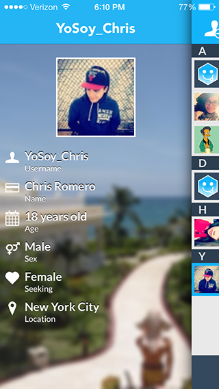
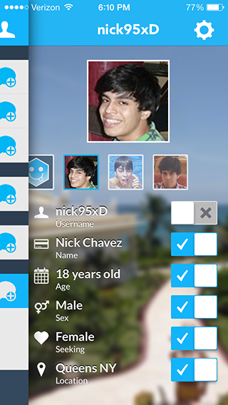
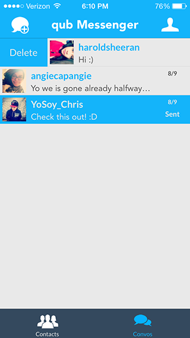

QubMessenger
============

iOS Messaging App with Server backend

Project based on market research of mobile messaging applications. Messaging application for iOS that
unites anonymous, random chat with contact-based messaging. Started to exercise programming, entrepreneurial
and self-management abilities. Read extensive material to learn programming languages, researched by interviewing
target age groups and learned to work on long term projects.

You can sign in with a qub account and message people anonymously and show/hide whatever parts of your info
you choose. You can also add them to your contacts and talk with them transparently.

So far, what's missing:
  Finding anonymous people
  User registration
  Finding contacts from phone
  Sending messages

I did this project over the summer after learning a lot about native iOS development. I cracked a couple of
books open and learned about how to program in Objective-C, the iOS visual paradigm and common UX patterns.

The application relies heavily on multi-threaded Core Data, which I wrote completely. It also depends on AFNetworking
 for communication with a server through JSON. I learned quite a lot about encryption and did my own service using
Blowfish public/private key encryption on the device and on the server. I learned all of thits plus all the basic
iOS stuff. Some visual effects I found on Github in lieu of spending time to write them myself -- I wanted to focus more on the more interesting stuff.

Check out the server repo for more info about the API I wrote. I might come back to this, but the project seems so
bloated -- I do regret not commenting the code out enough. Also, it seems like there's still a lot of work to be put
in.

The project was done in XCode 4, then 5. It compiles for iOS 6.1 and 7.0.

Screenshots
===========

The MIT License (MIT) Copyright © 2014 Nick Chavez
===============================

Permission is hereby granted, free of charge, to any person obtaining a copy of this software and associated documentation files (the “Software”), to deal in the Software without restriction, including without limitation the rights to use, copy, modify, merge, publish, distribute, sublicense, and/or sell copies of the Software, and to permit persons to whom the Software is furnished to do so, subject to the following conditions:

The above copyright notice and this permission notice shall be included in all copies or substantial portions of the Software.

THE SOFTWARE IS PROVIDED “AS IS”, WITHOUT WARRANTY OF ANY KIND, EXPRESS OR IMPLIED, INCLUDING BUT NOT LIMITED TO THE WARRANTIES OF MERCHANTABILITY, FITNESS FOR A PARTICULAR PURPOSE AND NONINFRINGEMENT. IN NO EVENT SHALL THE AUTHORS OR COPYRIGHT HOLDERS BE LIABLE FOR ANY CLAIM, DAMAGES OR OTHER LIABILITY, WHETHER IN AN ACTION OF CONTRACT, TORT OR OTHERWISE, ARISING FROM, OUT OF OR IN CONNECTION WITH THE SOFTWARE OR THE USE OR OTHER DEALINGS IN THE SOFTWARE.

